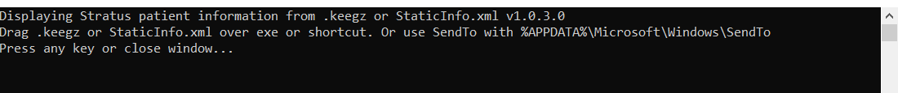

# keegz
See also [Blazor-keegz](https://www.github.com/jussivirkkala/BLazor-keegz) for version running in browser.

Displaying [www.stratuseeg.com](https://www.stratuseeg.com) keegz patient information. .NET8 (dot.net) Console app. Creates also .txt file into directory.



Build app into single win-x64 exe with following command.
```
dotnet publish -r win-x64 -c Release --self-contained true
``` 

You can also download x64 binary [keegz.exe](keegz.exe)

