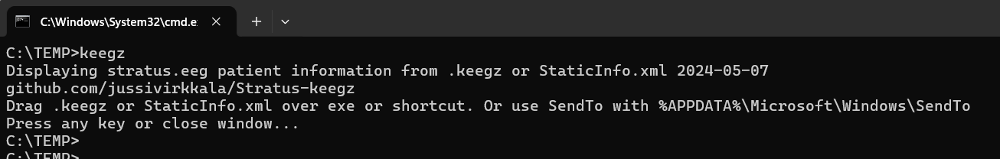

# keegz
 
Displaying www.stratuseeg.com keegz patient information. Console .NET5 app.

```
dotnet publish -r win-x64 -c Release --self-contained true -p:PublishSingleFile=true -p:IncludeAllContentForSelfExtract=true
``` 



You can also download x64 binary keegz.exe with SHA256: A0B78D3E4F6D25A172A4B6F4D6732911B68CDF6A30F64CFEDA8451238297DD84

